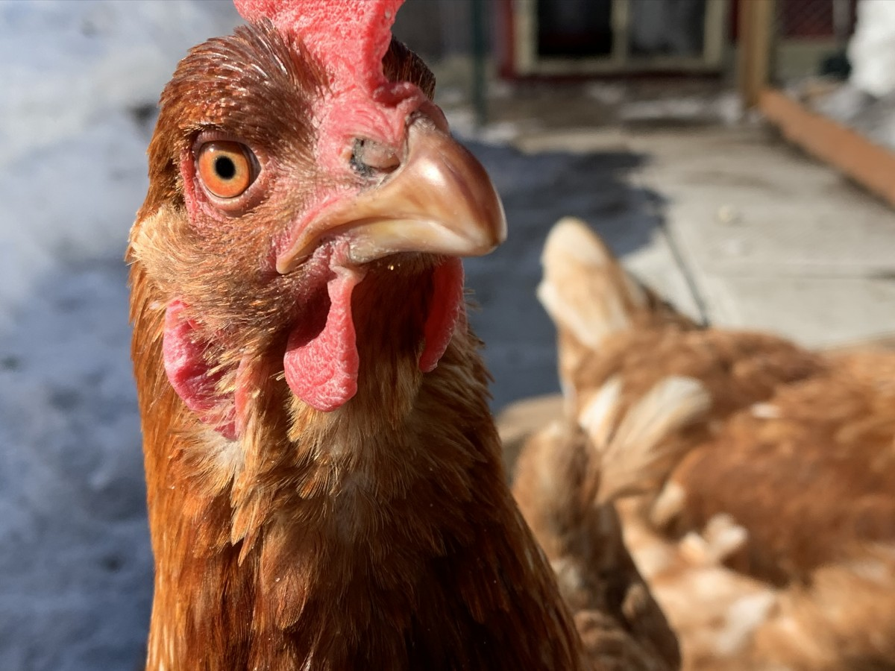

# EXQUISE-CORPS

Il etais une fois dans une ferme lointaine très lointaine, il y avais une poule 

Qui dans le dos de tous c'est amis poule ...

Voyant l'hiver approcher...

Se faisait une petite réserve de graines ,

Quelle comptait précieusement garder pour elle 

D'autres poules approchèrent ,

Et une bagarre éclatat . 

Billy la poule a déplumer deux des poules ,

Mais elle finit avec une aile casser , 

Elle vas donc esseyez de...

Se fisseler une branche à son aile cassée,

Pensant pouvoir s'en servir comme arme,

Pour démonter ce qui restait de poules ennemies.

"VOUS VOULEZ ME FAIRE LA GUERRE ?" Asked Billy Calmly.

Enragée et forte de ses réserves,

Dans l'innatendu, érigea la tourterie,

"Ennemis vous êtes, tourtes à la viande vous serez !" tonna Billy.

Oups : au poulet !!!